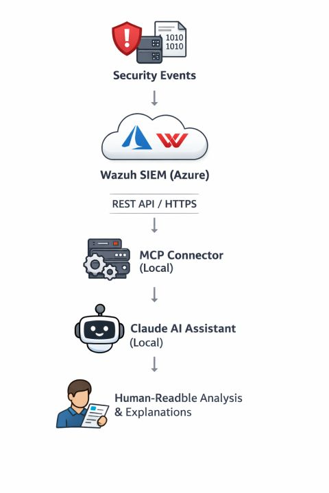
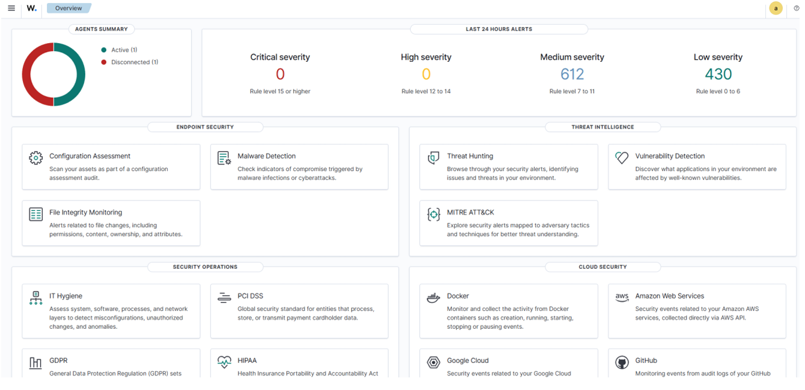
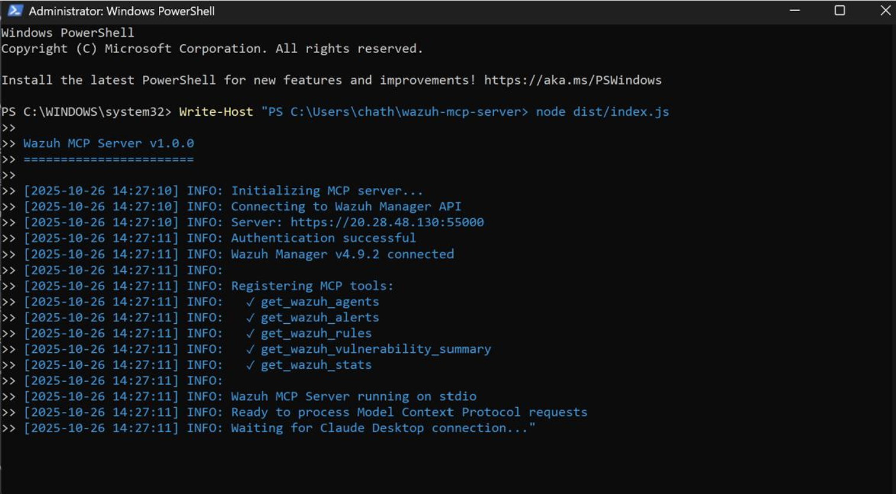
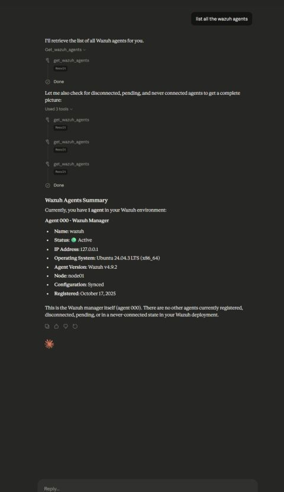
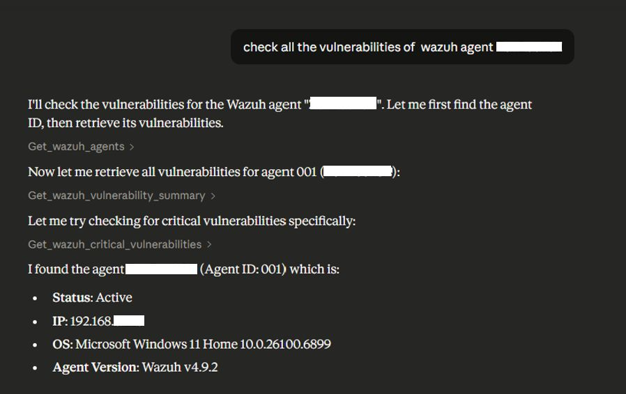

# AI-Powered Security Operations: Integrating Wazuh SIEM with Claude via Model Context Protocol (MCP)


An intelligent Security Operations (SOC) triage bridge connecting **Wazuh SIEM** to **Claude Desktop** using the **Model Context Protocol (MCP)**. This project enables natural-language security telemetry querying, automated vulnerability correlation, and conversational alert analysis across enterprise endpoints.

---

## Architecture Overview

This deployment utilizes a hybrid architecture that decouples cloud-based telemetry collection from local AI assistant workflows, maintaining a secure posture without exposing internal AI infrastructure directly to cloud endpoints.



### Key Components
1. **SIEM Telemetry Layer:** Wazuh Manager v4.9.2 running on an Azure Linux VM (Standard D2s v3), ingesting logs and performing endpoint posture assessment.
2. **Integration Layer:** Custom Model Context Protocol (MCP) server written in TypeScript, acting as a secure intermediary between the Wazuh REST API and the local LLM.
3. **AI Cognitive Layer:** Claude Desktop running locally, leveraging tool-use execution to query security data and synthesize context-rich incident explanations.

---

## Technical Features & Visibility

* **Conversational Incident Triage:** Translates complex JSON alerts and raw syslog feeds into plain-language summaries (e.g., distinguishing legitimate login anomalies from brute-force attempts).
* **Automated Posture Assessment:** Queries real-time vulnerability scan data per agent to isolate critical CVEs and misconfigurations.
* **Centralized SIEM Aggregation:** 



### Granular MCP Tool Registry
* `get_wazuh_agents`: Discovers active, disconnected, and pending endpoint agents.
* `get_wazuh_alerts`: Retrieves high-severity alerts from the SIEM event index.
* `get_wazuh_rules`: Explores active MITRE ATT&CK-mapped detection rules.
* `get_wazuh_vulnerability_summary`: Summarizes vulnerability exposure for a specified agent.
* `get_wazuh_critical_vulnerabilities`: Filters and prioritizes actionable, high-severity CVEs.
* `get_wazuh_stats`: Fetches daemon and cluster operational metrics.

---

## Demo Walkthrough

### 1. MCP Server Initialization
The local server establishes an authenticated session with the Azure-hosted Wazuh API and registers available tools over `stdio`.



### 2. Conversational Agent & Posture Discovery

**User Query:**
> *"List all the Wazuh agents and summarize their current state."*

**Claude Action (Tool Call: `get_wazuh_agents`):**
Claude dynamically queries the Wazuh API and formats the JSON response into a clean summary of connected endpoints.



### 3. Vulnerability Triage

**User Query:**
> *"Check all critical vulnerabilities for agent ZenBookSE."*

**Claude Action (Tool Call: `get_wazuh_critical_vulnerabilities`):**
Claude queries the agent's package database against known CVE feeds, interprets the CVSS severity, and maps out the compromised software versions.



---

## Installation & Setup

### Prerequisites
* Node.js (v18.0.0 or higher)
* Azure VM running Wazuh Manager v4.9.2
* Claude Desktop Application

### 1. Clone & Build the MCP Server
```bash
git clone [https://github.com/your-username/AI-Powered-Wazuh-SOC.git](https://github.com/your-username/AI-Powered-Wazuh-SOC.git)
cd AI-Powered-Wazuh-SOC/mcp-server
npm install
npm run build
